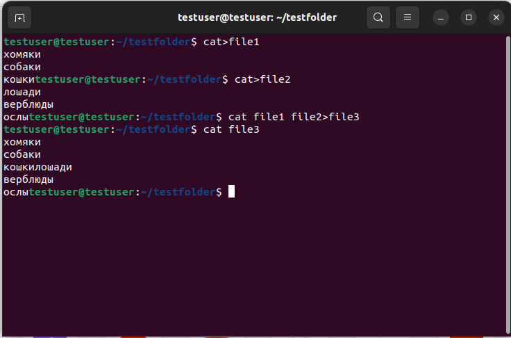
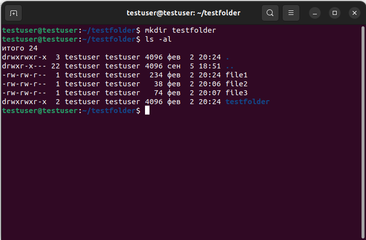

# Решение контрольных заданий
_**Задание:**_
**1. Используя команду cat в терминале операционной системы Linux, создать два файла Домашние животные (заполнив файл собаками, кошками, хомяками) и Вьючные животными заполнив файл Лошадьми, верблюдами ослы), а затем объединить их. Просмотреть содержимое созданного файла. Переименовать файл, дав ему новое имя (Друзья человека)**

_**Решение:**_

**2. Создать директорию, переместить файл туда.**

_**Решение:**_

